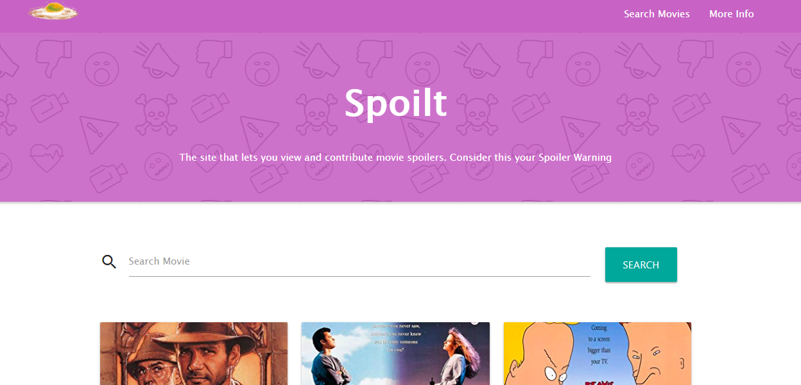
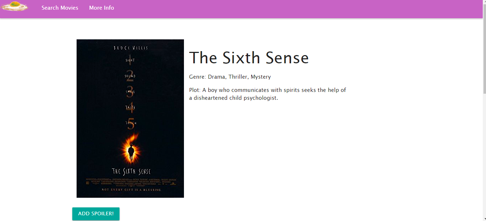

# Spoilt

## Description
The project is a live extensible collection of spoilers for movies and it should answer the simple question: What are the big twists present in popular films?

The user can type a movie title into the search bar to get a list of matching movies from the OMDB database. From there, the user can select a movie (which will add it to a custom API) and add a spoiler to the movie if they wish. Users are also free to browse the movies provided by the custom API and view, add, or update the spoilers for those movies.

Users can also add a vote to a spoiler they like. The number of votes each spoiler has will be displayed in its listing.

## Deployment

The web site is deployed on Azure web services and is available [HERE!](http://spoilt.azurewebsites.net/)

## API Documentation

This site utilizes two APIs for its movie data. Initial movie data is provided by [The Open Movie Database](http://www.omdbapi.com/). Movie and spoiler data are saved to a [custom API](https://github.com/riedmank/SpoiltAPI). [Click here to learn more about it.](http://spoiltapi.azurewebsites.net)

## Getting started

## Data Flow

[via Draw.io](https://drive.google.com/file/d/1IFFtjAH4dUni1PaxVeMAQhD2gnpLQGjW/view?usp=sharing)

## DB Schema

[via Draw.io](https://drive.google.com/file/d/1eHAOgXhjIG1nHJZCODZFJXvgQngcCMjT/view?usp=sharing)

## Front-End Wireframes

[View Front End Wireframes Here!](https://drive.google.com/file/d/1xYxxaKeHhpdsocGPuocCbg6nVn7sNYcc/view)

## Tech stack

This project utilizes the following tech...
* __C#__ and __.NET Core__ provide the foundation for this project.
* __MVC__ and __Entity Framework__ with __Razor Views__ handles the front-end.
* __HTML__, __JavaScript__, __CSS__, __SASS__, __JQuery__, and __MaterializeCSS__ for front-end presentation and styling.

## User stories

1. As a user, I want to search the site's database to see if a movie has any spoilers so I know if the spoiler I want to add has already been documented.
    - I can search the site for movies in the database. If a movie is already included, I can click on that movie and see all of the spoilers users have submitted for that movie.
    - If a movie is not already in the database, I will get information provided by the OMDB API. 
2. As a user, I want to add spoilers to movies so that everybody can come and find out about the movie's ending and/or twists in the plot.
    - I can enter a spoiler into a text field and save it so that it will be displayed with all of the other user-submitted spoilers for that particular movie.
    - If the movie was not already saved into the database, certain OMDB data will be saved, inlucding the movie title, plot synopsis, IMDB id, and poster. 
3. As a developer, I want to use MVC framework, so that I can get the working skeleton of the app.
    - API and Front-end implemented using a model-view-controller approach.
    - Dependency injection pattern exploited for controller implementation.
4. As a developer, I want to use EF code first approach, so the framework would deal with DB stuff.
    - SQL server setup implemented through models.
    - CRUD operations work from the box in scaffolded controllers/view.

## Images

## Credits

Thanks to OMDB for use of their API for movie data.
Thanks to Ellen Whitwell for her rotten egg drawing!
